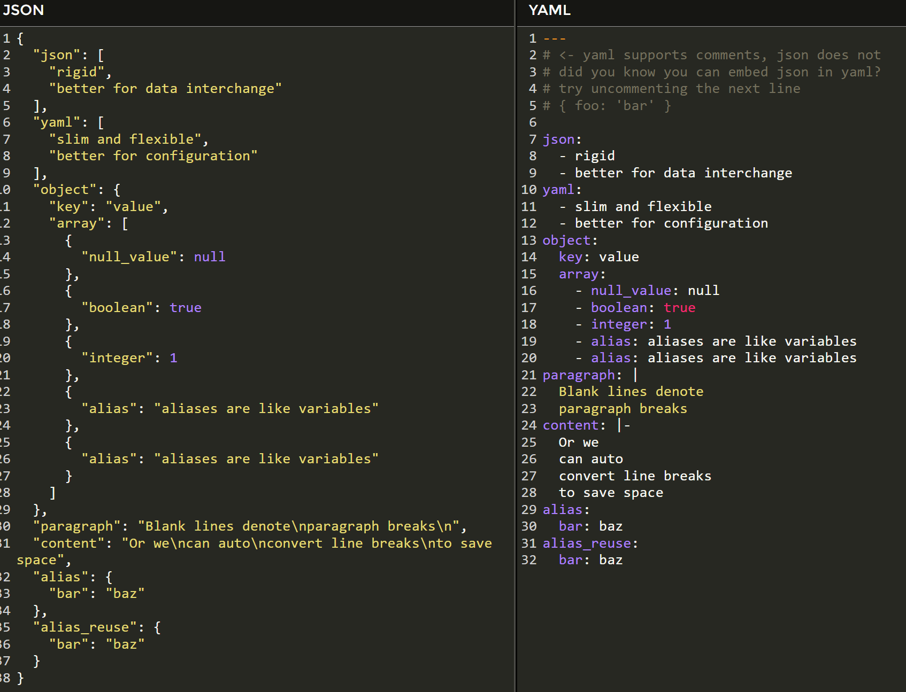

# YAML over JSON

: To keep the final CV-Data in YAMAL format is more consise, easier to read, edit and less error-prone than JSON when working manually on it.

Many tools such as [BairsDev](https://www.bairesdev.com/tools/json2yaml/) are currently are available to translate YAML into JSON and vice versa.